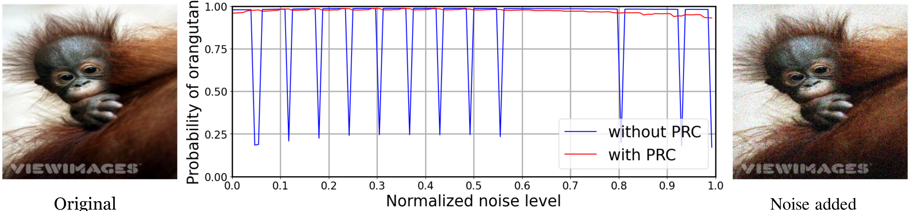
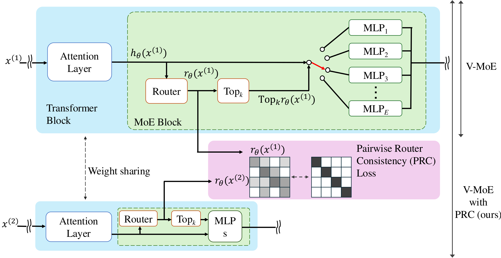

# Robustifying Routers Against Input Perturbations for Sparse Mixture-of-Experts Vision Transformers [OJSP, ICASSP 2025]
Masahiro Kada [1], Ryota Yoshihashi [1], Satoshi Ikehata [1][2], Rei Kawakami [1], Ikuro Sato [1][3]

[1] Institute of Science Tokyo  
[2] National Institute of Informatics  
[3] Denso IT Laboratory



This repository contains the code for Robustifying Routers Against Input Perturbations for Sparse Mixture-of-Experts Vision Transformers (PRC). This work has been published in [OJSP](https://ieeexplore.ieee.org/document/10858379) and will be presented at ICASSP 2025.

- **Paper:** [10.1109/OJSP.2025.3536853](https://ieeexplore.ieee.org/document/10858379)

## Abstract
Mixture of experts with a sparse expert selection rule has been gaining much attention recently because of its scalability without compromising inference time. However, unlike standard neural networks, sparse mixture-of-experts models 
inherently exhibit discontinuities in the output space, which may impede the acquisition of appropriate invariance to the input perturbations, leading to a deterioration of model performance for tasks such as classification. To address this issue, we propose Pairwise Router Consistency (PRC) that effectively penalizes the discontinuities occurring under natural deformations of input images. With the supervised loss, the use of PRC loss empirically improves classification accuracy on ImageNet-1K, CIFAR-10, and CIFAR-100 datasets, compared to a baseline method. Notably, our method with 1-expert selection slightly outperforms the baseline method using 2-expert selection. We also confirmed that models trained with our method experience discontinuous changes less frequently under input perturbations.



## How to use
0. (Optional) Put the dataset in the tensorflow_datasets folder
For datasets that require manual download, such as ImageNet, download the data and place it in tensorflow_datasets/downloads/manual/.

1. Build docker image 
```
cd docker
./init.sh (image_name:tag)
```

If you do not set an image name, the image name will be set to vmoe:last.

2. Run the training
```
./run.sh 0 zsh
(docker) > cd app
(docker) > ./run_full.sh run_name # Pretrain in ImageNet1K
# TODO: Edit the config file (app/vmoe/configs/vmoe_paper/prc_ilsvrc2012_ft.py) and write a pre-training checkpoint path.
(docker) > ./run.sh run_name2 # Fine tuning in ImageNet1K
```
The first argument is the GPU number. When selecting multiple GPUs, enter them separated by commas without spaces. If you want to use all GPUs, enter all.

You can download the trained model checkpoints [here](https://drive.google.com/drive/folders/16XhaS7f-3ZOCyFF9bBVbPisN08lrnnmX?usp=drive_link).

## BibTeX
```
@ARTICLE{10858379,
  author={Kada, Masahiro and Yoshihashi, Ryota and Ikehata, Satoshi and Kawakami, Rei and Sato, Ikuro},
  journal={IEEE Open Journal of Signal Processing}, 
  title={Robustifying Routers Against Input Perturbations for Sparse Mixture-of-Experts Vision Transformers}, 
  year={2025},
  volume={},
  number={},
  pages={1-9},
  keywords={Perturbation methods;Routing;Transformers;Predictive models;Contrastive learning;Data models;Computational modeling;Training;Image classification;Computer vision;Mixture of Experts;Dynamic Neural Network;Image Classification;Vision Transformer},
  doi={10.1109/OJSP.2025.3536853}}
```

## Acknowledgements
This work was supported by JSPS KAKENHI Grant Number JP22H03642 and DENSO IT LAB Recognition and Learning Algorithm Collaborative Research Chair (Science Tokyo).

This repository is a fork of [V-MoE](https://github.com/google-research/vmoe). We appreciate the original project and its contributors.